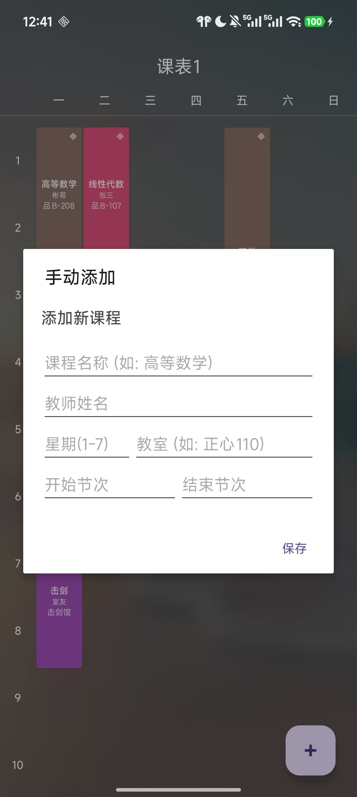
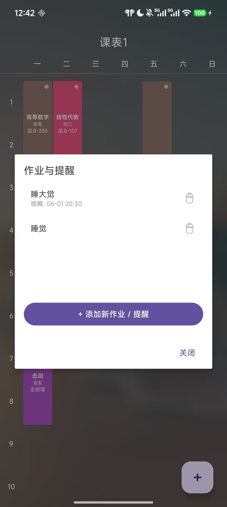
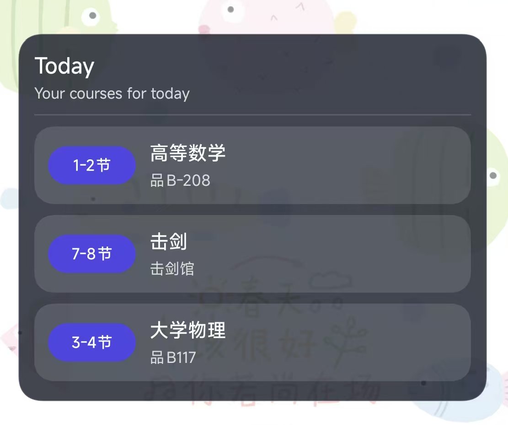

# SmartCourseSchedule

## Description

SmartCourseSchedule 是一个基于 Android 的智能课程表应用，用于帮助学生管理课程安排与作业提醒。  
应用支持多课表管理、课程时间安排、作业提醒以及今日课程桌面小组件等功能，方便用户快速查看当天课程信息并进行日常学习管理。

该项目采用 MVVM 架构设计，结合 Room 本地数据库与 LiveData 数据观察机制，实现课程信息的持久化管理和界面的自动更新。

---

## Features

- 多课表管理（支持创建、切换和删除课表）
- 课程信息管理（添加、编辑、删除课程）
- 灵活的课程时间设置（星期、节次、周次）
- 课程冲突检测
- 作业管理与截止提醒
- 今日课程桌面小组件
- 课程地点导航
- 课表视图展示

---

## Tech Stack

本项目主要使用以下技术实现：

- **Language:** Java  
- **Architecture:** MVVM  
- **Database:** Room  
- **State Management:** LiveData + ViewModel  
- **Dependency Injection:** Hilt  
- **UI:** Android ViewBinding + RecyclerView  
- **Image Loading:** Glide  
- **Widget:** AppWidget + RemoteViews  
- **Notification:** AlarmManager + BroadcastReceiver

---

## Screenshots

下面展示应用的一些主要功能界面：

### 课表主界面


### 添加课程


### 作业管理


### 今日课程桌面小组件


> 以上截图仅为示例，你可以替换为实际截图。

---

## Main Functions

本应用提供以下主要功能：

- **课程管理**  
  用户可以创建课程并设置课程名称、教师、地点、节次和周次等信息。

- **课表视图**  
  以周视图形式展示课程安排，帮助用户快速查看每天的课程情况。

- **作业提醒**  
  支持为课程添加作业并设置提醒时间，通过系统通知提醒用户完成作业。

- **桌面小组件**  
  在手机桌面上显示当天课程，方便用户无需打开应用即可查看今日安排。

---

## How to Run

1. 克隆项目到本地

```bash
git clone https://github.com/666ydli/SmartCourseSchedule.git
```
2. 使用 Android Studio 打开项目

3. 等待 Gradle 同步完成

4. 连接 Android 模拟器或真机

5. 点击 Run 运行应用

## License

This project is intended for learning and demonstration purposes.
